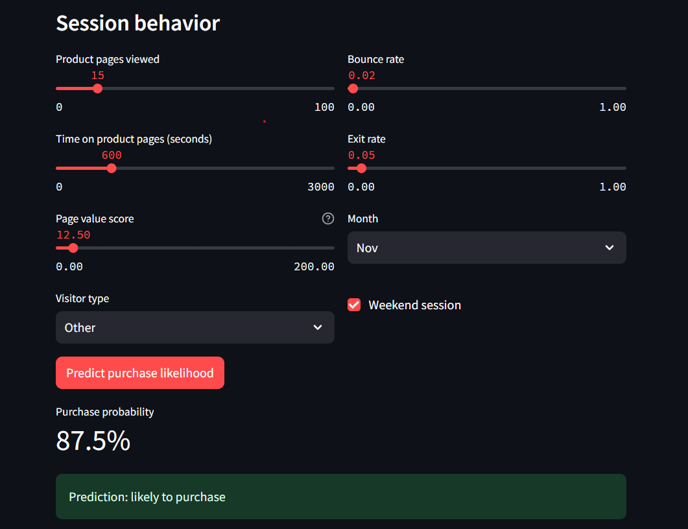

# Purchase Intent GCP

An XGBoost classifier that predicts whether an e-commerce session will end in a purchase, benchmarked against a logistic regression baseline and a neural network, packaged as a FastAPI service, deployed on Google Cloud Run, backed by a CI/CD gate that retrains and validates the model on every pull request.

**Live demo:** https://purchase-intent-demo-513193518506.europe-west3.run.app
**API:** https://purchase-intent-api-513193518506.europe-west3.run.app



---

## The problem

Predict whether a website session ends in a purchase (`Revenue = True`) using session behavior features (page views, durations, bounce/exit rates, traffic source, visitor type, month) from the [UCI Online Shoppers Purchasing Intention dataset](https://archive.ics.uci.edu/dataset/468/online+shoppers+purchasing+intention+dataset) — 12,330 sessions, 15.5% positive class.

The interesting part of this problem isn't fitting a model — it's handling a real class imbalance honestly, picking a model with evidence instead of a default, and shipping it somewhere a model actually needs to run in production.

## Model selection: the evidence, not the assumption

| Model | PR-AUC | ROC-AUC |
|---|---|---|
| Naive baseline (predict majority class) | 0.155 | — |
| Logistic Regression (class-weighted) | 0.6081 | 0.8828 |
| Keras Neural Network | 0.6686–0.6824 | 0.905–0.907 |
| **XGBoost (selected)** | **0.7438–0.7469** | **0.929–0.931** |

*(PR-AUC — average precision — is the headline metric, not accuracy: with an 84.5%/15.5% class split, a model that always predicts "no purchase" scores 84.5% accuracy while being useless.)*

XGBoost was chosen because it beat the neural network by a wide, reproducible margin across two separate machines — not because gradient boosting is the popular default for tabular data. The neural network was fully built, trained, and evaluated specifically so this comparison could be evidence rather than an assumption. It's kept in the repo as a benchmarking-only dependency (`requirements-bench.txt`), separate from the production stack, since it never ships.

## Architecture

```
CSV data → feature pipeline (sklearn ColumnTransformer, cyclical month encoding)
        → XGBoost training (class-weighted for imbalance)
        → model artifact (joblib) + manifest (version, eval metrics)
        → FastAPI service (/predict, /health, /model-info)
        → Docker container → Cloud Run (europe-west3)

Streamlit demo (separate Cloud Run service) → calls the API over HTTPS
```

Two independently deployed Cloud Run services: the prediction API and the interactive demo, talking to each other over a real network boundary, not a shared process.

## CI/CD safety gate

Every pull request triggers a GitHub Actions workflow that:
1. Runs API contract tests (schema validation, rejects malformed input)
2. **Retrains XGBoost from scratch and asserts PR-AUC ≥ 0.68** — a floor set with margin below the known-good result (0.7438–0.7469) and above the neural network's result, so it catches both genuine regressions and "accidentally shipped the worse model."

This isn't a theoretical gate. It was verified by deliberately removing `PageValues` — the single strongest predictor — from the feature pipeline: PR-AUC collapsed to 0.3565 and the build correctly failed. Restored, it passes clean at 0.7469. Same category of gate as [PromptGuard](https://github.com/beawesome8/Prompt-Guard), applied to a classic ML pipeline instead of an LLM one.

## Repo structure

```
├── src/
│   ├── features.py          # feature pipeline (cyclical month encoding, scaling, one-hot)
│   ├── train_baseline.py    # Phase 1: logistic regression baseline
│   ├── train_candidates.py  # Phase 2: XGBoost vs Keras NN benchmark
│   ├── train_final.py       # Phase 3: champion model trained on full data
│   └── serve/
│       ├── main.py          # FastAPI app
│       └── schemas.py       # Pydantic request/response contracts
├── demo/                    # Streamlit interactive demo (separate Cloud Run service)
├── tests/
│   ├── test_api.py          # API contract tests
│   └── test_regression_gate.py  # the CI/CD safety gate
├── .github/workflows/ci.yml
├── Dockerfile
├── requirements.txt          # production dependencies only
└── requirements-bench.txt    # + TensorFlow, for reproducing the model comparison
```

## Development history

Built in explicit, tagged phases — each one verified before the next started:

| Tag | Phase |
|---|---|
| `v0.1-baseline` | Logistic regression baseline, honest PR-AUC metric established |
| `v0.2-model-comparison` | XGBoost vs Keras NN, XGBoost selected on evidence |
| `v0.3-api-container` | Model persisted, wrapped in FastAPI, containerized |
| `v0.4-gcp-deployed` | Live on Cloud Run |
| `v0.5-live-demo` | Streamlit demo, second Cloud Run service |
| `v0.6-cicd-gate` | GitHub Actions regression gate, verified against a real sabotaged run |

`archive_v0_notebook.ipynb` is kept in the repo as the original exploratory notebook — no train/test split, no imbalance handling, no evaluation metrics. Kept deliberately, not deleted, as the honest starting point this project was rebuilt from.

## Running locally

```bash
python -m venv venv
source venv/Scripts/activate  # or venv/bin/activate on macOS/Linux
pip install -r requirements.txt
python src/train_final.py
uvicorn src.serve.main:app --reload
```

```bash
cd demo
pip install -r requirements.txt
API_URL="http://localhost:8000" streamlit run streamlit_app.py
```

## Tech stack

**Production:** Python, XGBoost, scikit-learn, FastAPI, Pydantic, Docker, Google Cloud Run, Google Artifact Registry, GitHub Actions
**Benchmarking only (not deployed):** TensorFlow/Keras

## Author

Aman Benjamin Emmanuel — [portfolio](https://beawesome8.github.io) · [GitHub](https://github.com/beawesome8) · [LinkedIn](https://www.linkedin.com/in/beawesome8)

## License

MIT
